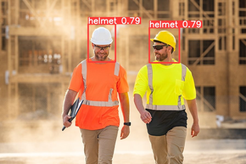

# Safety Helmet Detection Based On YOLOV10



## Table of Contents
- [Overview](#overview)
- [Features](#features)
- [Usage](#usage)
- [Dataset](#dataset)
- [Contact](#contact)

## Overview
This project demonstrates the training and deployment on Streamlit of a YOLOv10 model to detect safety helmets. The model is designed to help ensure workplace safety by identifying whether individuals are wearing helmets in images or video.

## Features
- **High accuracy**: Utilizes YOLOv10 for robust performance.
- **Customizable**: Easy to retrain with your own dataset.
- **Scalable**: Suitable for both small and large datasets.

## Installation
1. **Clone the repository:**
   ```bash
   git clone https://github.com/yourusername/helmet-detection-yolov10.git
   cd helmet-detection-yolov10
   ```
2. **Install the required dependencies:**
    ```bash
    pip install -r requirements.txt
    ```

## Usage
Deployment on Streamlit:

    ```bash
    streamlit run app.py
    ```
## Dataset
The dataset used for training and evaluation is the [Hard Hat Detection](https://www.kaggle.com/datasets/andrewmvd/hard-hat-detection) dataset from Kaggle. This dataset contains images labeled with the presence of hard hats, making it suitable for training models to detect safety helmets. It includes a variety of scenes and different angles to provide a comprehensive training set for robust detection.


## Contact 
For questions or suggestions, please open an issue or contact:
- My email: trungkienle171100@gmail.com 
- Github: https://github.com/TrungKiencding
